# <h1 style="text-align: center;">Zerosx-Cloud 多租户开发平台</span>

<div style="text-align: center">逝者如斯夫，不舍昼夜！</div>
<div style="text-align: center">
  
  
</div>
<div style="text-align: center">
  
  
  
  
  
</div>
<div style="text-align: center">
  
  
  
  
</div>

# <h3 style="text-align: center;color:red;">如果觉得对您有所帮助，请点右上角 "Star" 支持一下，谢谢啦</h1>
<div style="border-bottom: 1px solid #dcdfe6;margin-top: 50px;"></div>


### 1. 简介

此平台是由作者个人兴趣下搭建及开发，完全开源，免费使用，仅供学习参考。

* 基于JDK8、SpringBoot2.7.14、SpringCloud2021.0.5和SpringCloudAlibaba2021.0.5.0且采用前后端分离的微服务多租户体系架构。
* 采用自定义starter组件化的思想，结构解耦，易于扩展。
* 实现了SpringCloudGateway集成OAuth2统一认证授权及URL级功能权限校验（适用于网络隔离场景，即网关是统一入口），且可自定义扩展OAuth2授权模式。
* 集成Knife4j的OpenAPI3的接口文档，方便前后端对接，基础功能和文档注释完全由代码生成器一键生成（前后端代码）。
* 代码生成器一键生成基础CRUD功能，节约开发时间，更多注重业务开发。
* 提供一套基于Vue2.x的前端项目[zerosx-vue2]，此项目是参考【若依】前端开源改造，感谢若依，作者前端刚开始学习，不喜勿喷。
* 与此架构类似的项目已在作者所在公司线上运营，对于中小型企业项目开发是非常有性价比的一套架构。

### 2. 软件架构

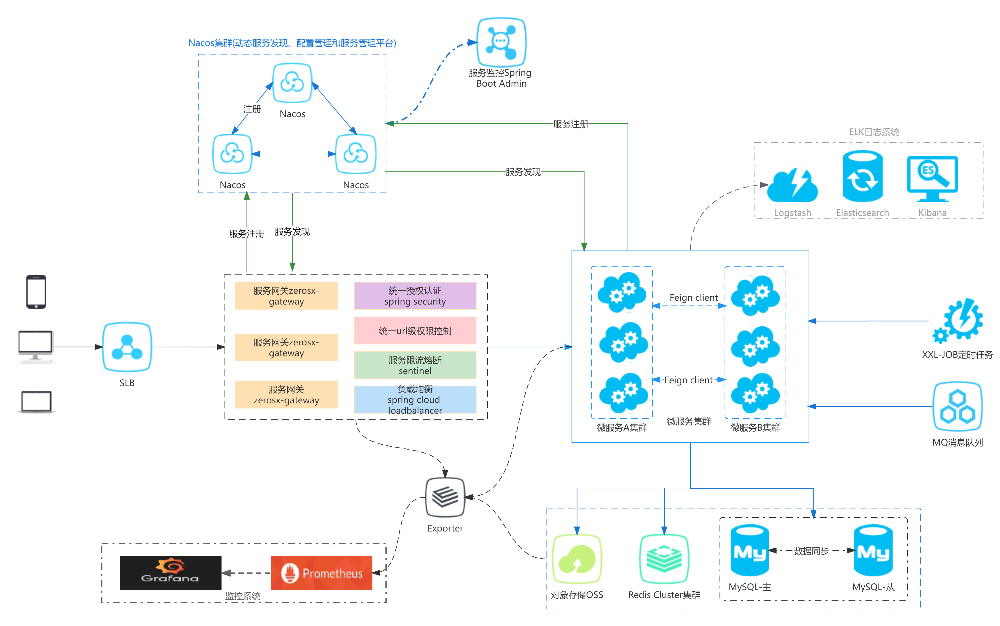

### 3. 使用说明

1. 先启动zerosx-gateway、zerosx-auth、zeros-system这三个项目；
2. 启动前端项目，启动说明请看【zerosx-ui/zerosx-vue2/README.md】；
3. 浏览器访问前端地址，即可体验。
4. 调试接口文档：
  * 网关聚合入口：http://{gateway.host}:{gateway.port}/doc.html
  * 单体微服务入口：http://{app1.host}:{app1.port}/doc.html (推荐，无token校验)

### 4. 基础功能简介

* 首页
* 租户管理
    * 租户管理：接入系统的租户公司的管理
* 权限管理
    * 用户管理：系统用户的配置，及管理租户的数据权限分配
    * 角色管理：角色菜单权限分配
    * 部门管理：配置租户的组织部门，也可用作用户组，简化新用户的权限分配
    * 岗位管理：岗位管理，用户所担任的职务
* 系统管理
    * 菜单管理：菜单、按钮、功能权限的管理，生成动态路由
    * 字典管理：数据字典的维护
    * 参数设置：系统动态参数的维护
    * 日志管理
        * 操作日志：操作记录日志
        * 登录日志：OAuth2授权登录日志
* 资源管理
    * 文件管理：OSS存储的文件管理，主要是维护所有文件上传到OSS服务器的记录
    * 行政区域：中华人民共和国行政区域的维护
    * 系统监控：SpringBootAdmin系统监控
    * 接口文档：OpenAPI3聚合接口文档

### 5. 打包部署

* 编译打包jar

```shell
mvn clean package -DskipTests -Pprod
```

* 打包镜像

```shell 
docker build -t zeros-cloud/zeros-gateway:v1.0.0 .
```

* 推送远程仓库

```shell
#推送远程仓库 示例
#登录
docker login --username=841132320@qq.com registry.cn-shenzhen.aliyuncs.com
#tag
docker tag [imageId] registry.cn-shenzhen.aliyuncs.com/zeros-cloud/zeros-ui:v1.1.0
#push
docker push registry.cn-shenzhen.aliyuncs.com/zeros-cloud/zeros-ui:v1.1.0
```

* 部署说明

> 因服务器资源有限，组件均采用 **Docker** 单节点方式部署，使用 **Docker Compose** 进行编排，安装的组件及版本如下：<br>
> 
> 
> <br>
> 部署应用如下：<br>
> 
> 
> 

### 6. 在线体验

* 演示地址：<a href="http://120.79.152.222/index"> http://120.79.152.222/index </a>

> <span style="color:#666">目前版本只有基础功能，其他功能还在逐步完善中，敬请期待</span>

### 7. 演示系统截图：

<table>
    <tr>
       <td></td>
       <td></td>
    </tr>
    <tr>
       <td></td>
       <td>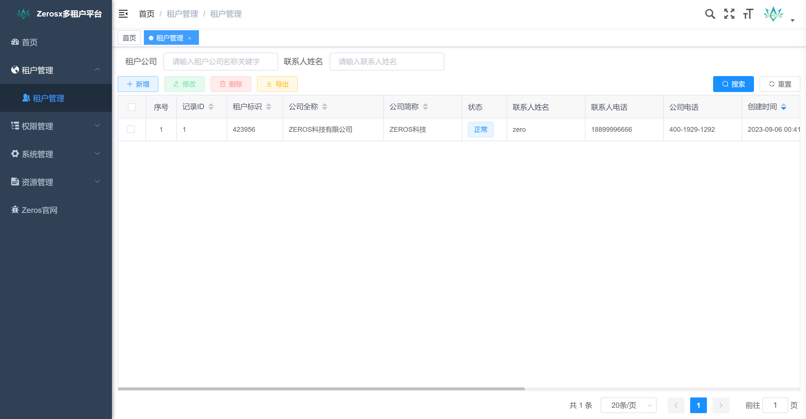</td>
    </tr>
    <tr>
       <td>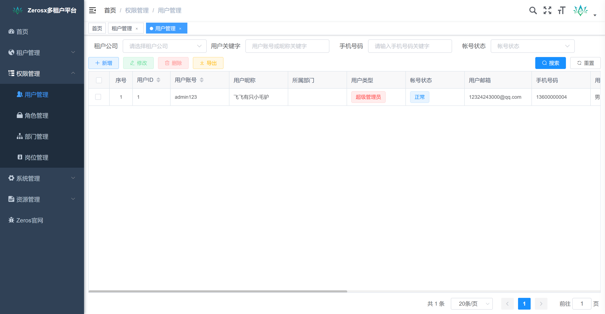</td>
       <td>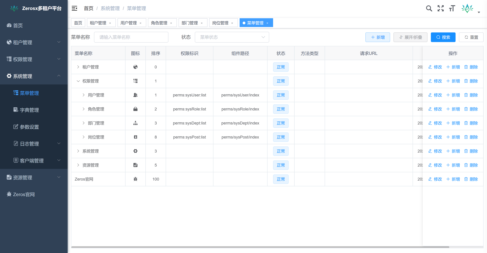</td>
    </tr>
    <tr>
       <td>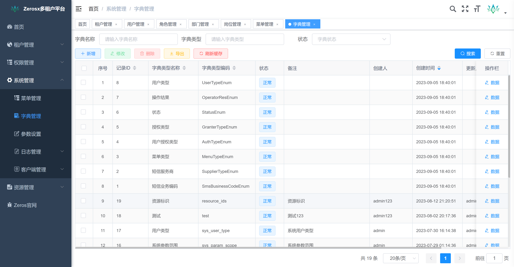</td>
       <td>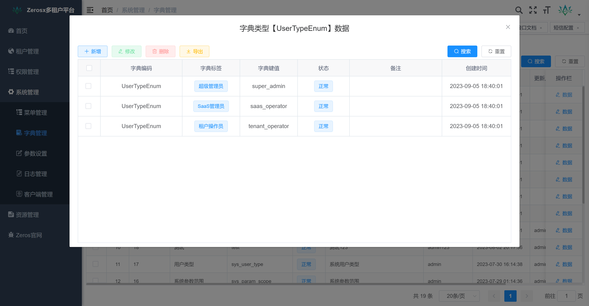</td>
    </tr>
    <tr>
       <td>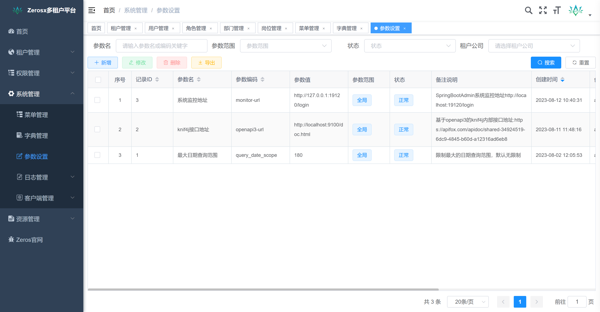</td>
       <td>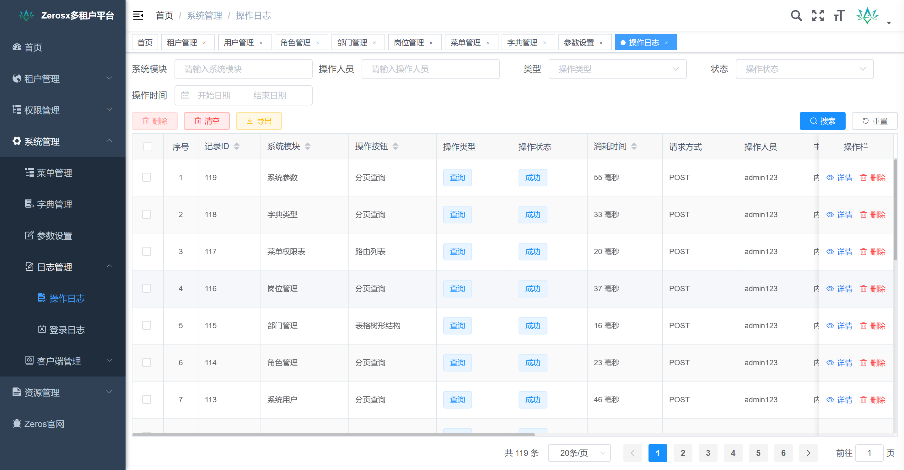</td>
    </tr>
    <tr>
       <td>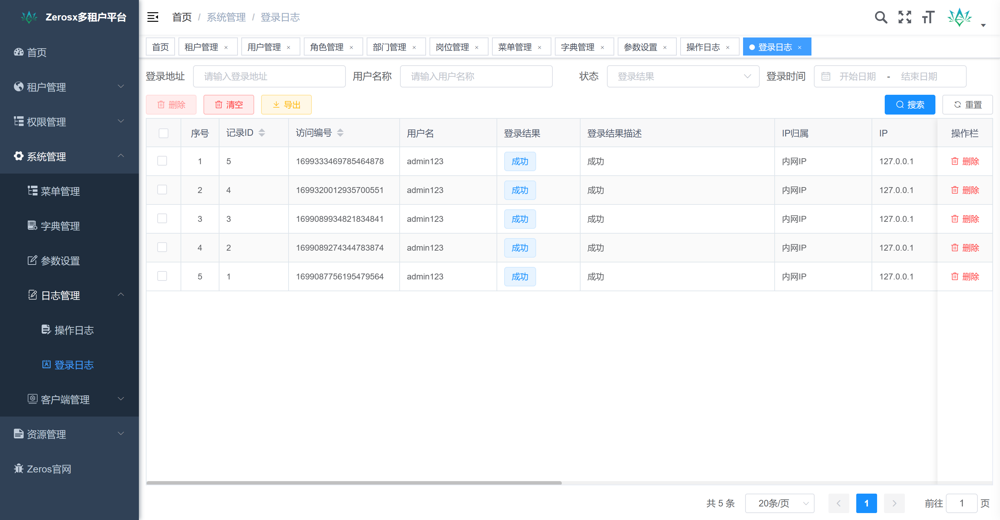</td>
       <td>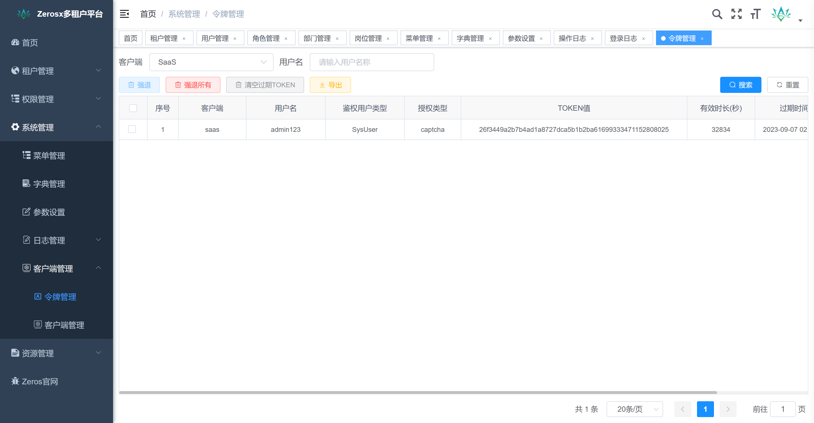</td>
    </tr>
    <tr>
       <td>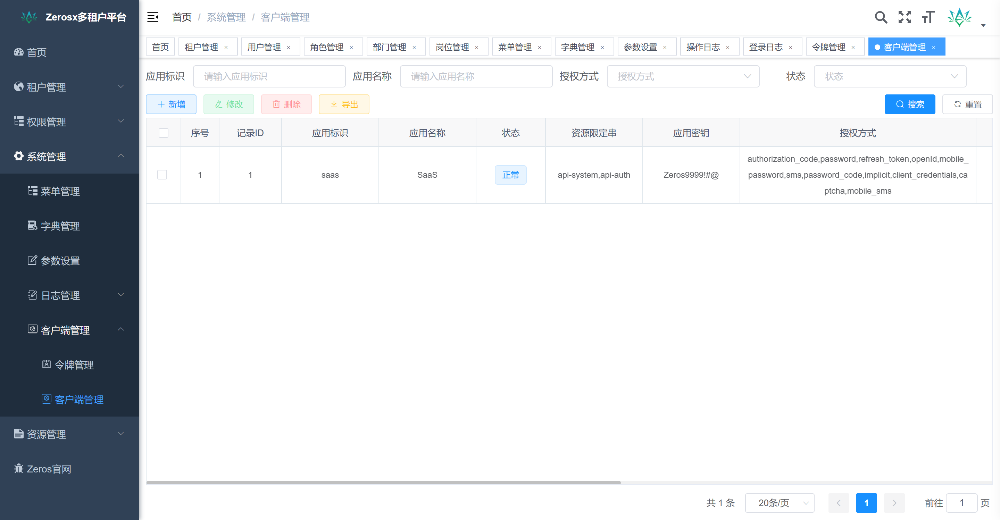</td>
       <td>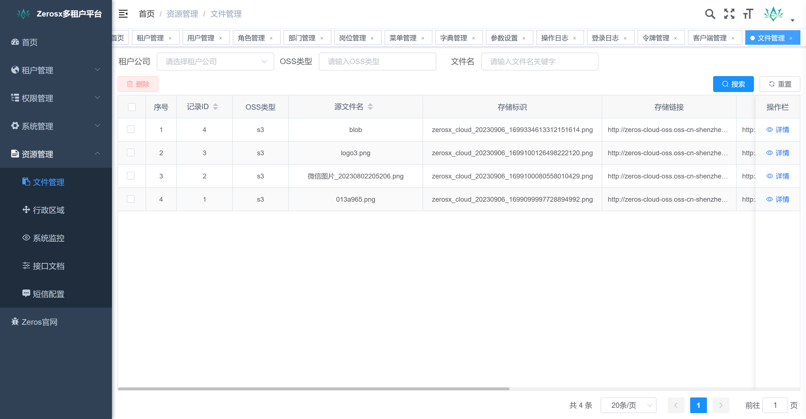</td>
    </tr>
    <tr>
       <td>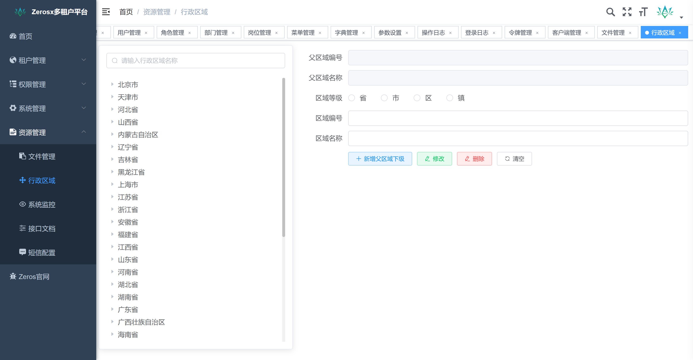</td>
       <td>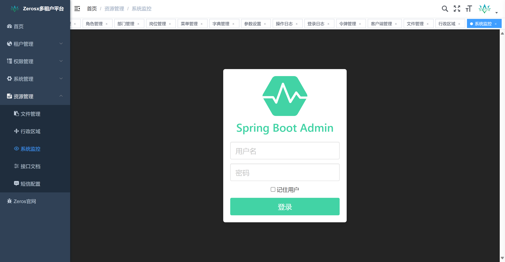</td>
    </tr>
     <tr>
       <td>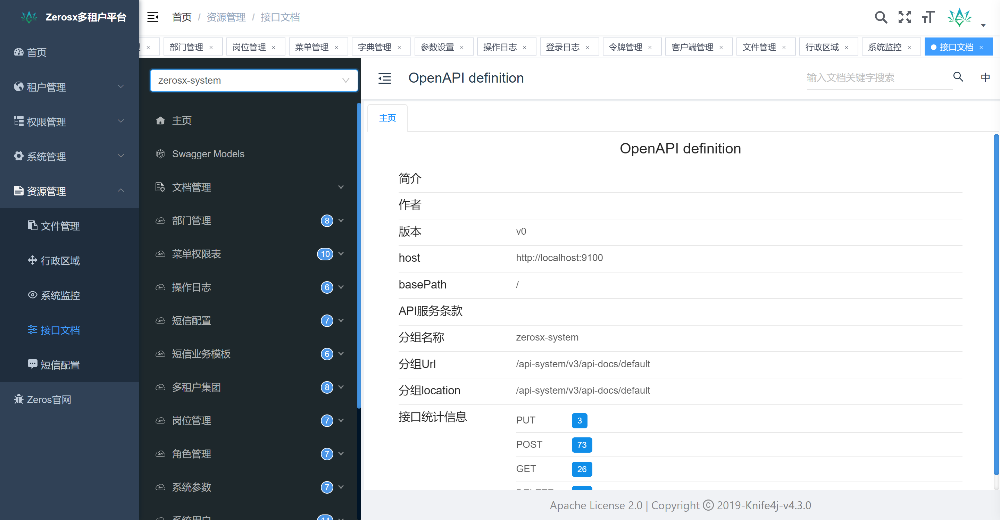</td>
       <td>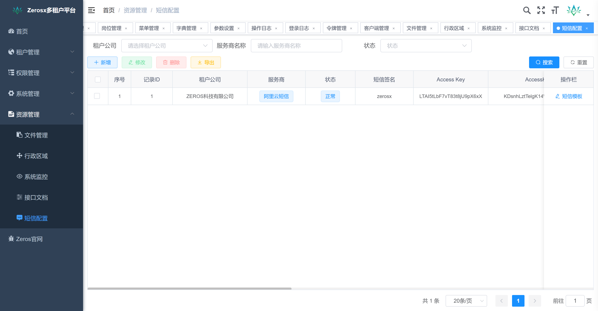</td>
    </tr>
     <tr>
       <td>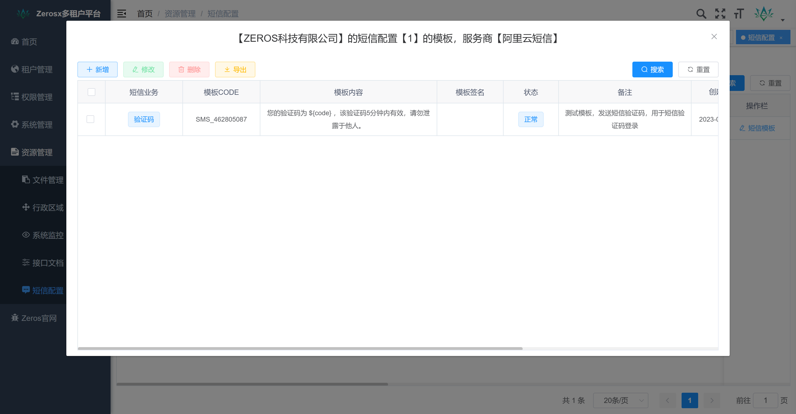</td>
    </tr>
</table>