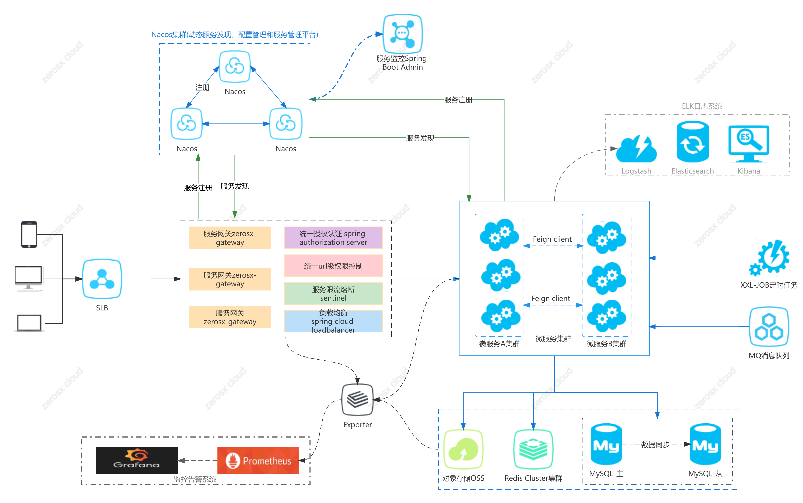
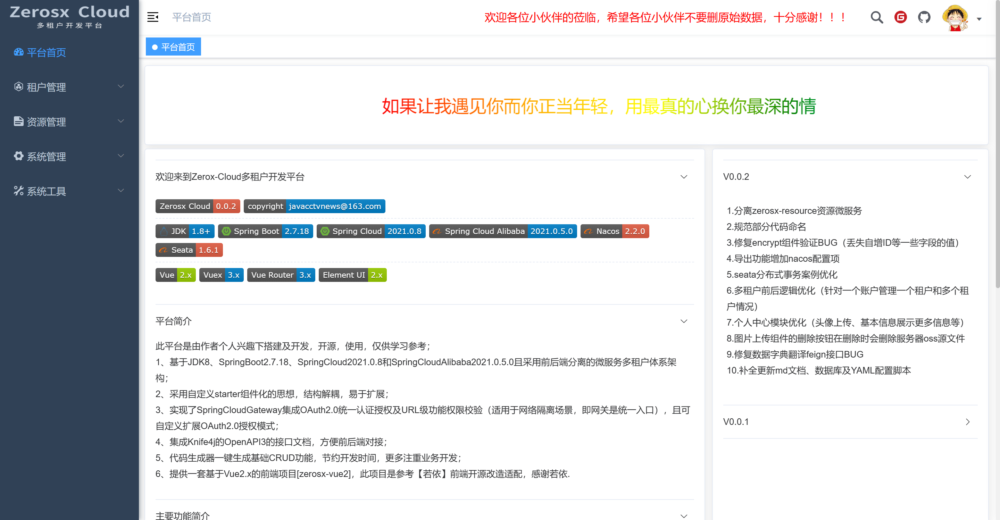
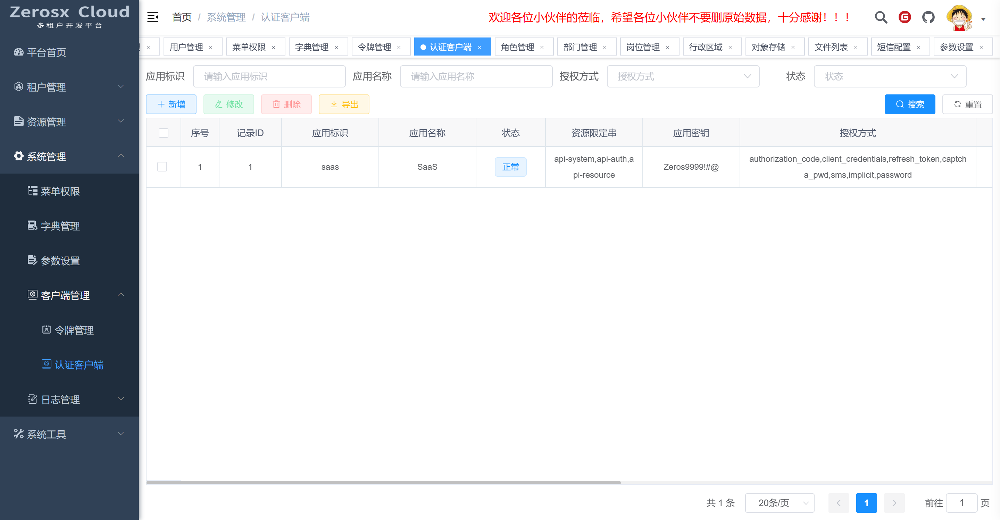
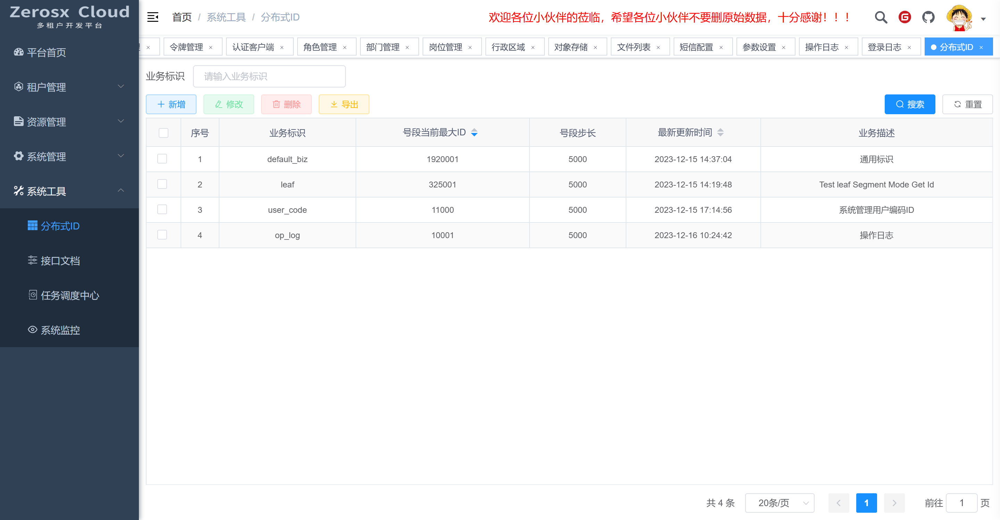
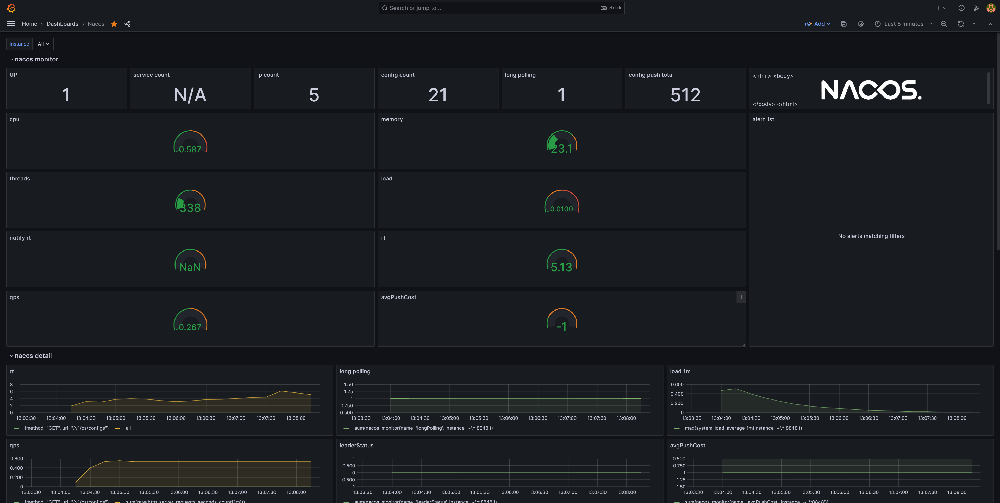

<h1 style="text-align:center">
    Zerosx-Cloud 多租户开发平台
</h1>


<div style="text-align: center">逝者如斯夫，不舍昼夜！</div>
<div style="text-align: center">
  
  
</div>
<div style="text-align: center">
  
  
  
  
  
  
</div>
<div style="text-align: center">
  
  
  
  
</div>
<h3 style="text-align:center;color:red;font-size:16px;">如果觉得对您有所帮助，请点右上角 "Star" 支持一下，谢谢啦</h3>

------


### 平台简介

此平台是由作者个人兴趣下搭建及开发，开源，免费，仅供学习参考。

* 基于JDK17、SpringBoot3.1.5、SpringCloud2022.0.4和SpringCloudAlibaba2022.0.0.0且采用前后端分离的微服务多租户体系架构；
* 采用自定义starter组件化的思想，结构解耦，易于扩展；
* 实现了SpringCloudGateway集成Spring Authorization Server统一认证授权及URL级功能权限校验（适用于网络隔离场景，即网关是统一入口），且可自定义扩展授权模式；
* 集成Knife4j基于OpenAPI3的接口文档，方便前后端对接；
* 代码生成器一键生成基础CRUD功能，节约开发时间，更多注重业务开发；
* 提供一套基于Vue2.x的前端项目[zerosx-vue2]，此项目是参考【若依】前端开源改造适配，感谢若依（Vue初学者，还不具备从零搭建一个完整的Vue项目，所以目前只能借鉴改造，勿喷^_^）。

### 软件架构图



> 备注：图中灰色虚线块组件作者并未搭建（服务器资源有限），只做一个选型参考。

### 项目结构

```shell
├─zerosx-cloud								#顶级工程目录
│ └─doc						              	#项目文档（组件、SQL、操作说明）
│   └─docker		              			#系统所用到的组件的安装文档
│   └─zerosx		              			#系统所用到的SQL和YAML配置
│ └─zerosx-api				              	#Feign对内api
│   └─zerosx-api-auth		              	#授权服务api
│   └─zerosx-api-examples	              	#示例工程api
│   └─zerosx-api-system		              	#系统服务api
│   └─zerosx-api-resource		            #资源服务api
│ └─zerosx-auth			                  	#授权认证服务
│ └─zerosx-commons		                  	#通用模块
│   └─zerosx-common-base					#公共POJO、工具类
│   └─zerosx-common-bom						#common模块依赖项
│   └─zerosx-common-core					#公共核心模块
│   └─zerosx-common-db						#数据权限
│   └─zerosx-common-dynamic-datasource		#动态数据源
│   └─zerosx-common-dynamictp				#动态可监控线程池框架
│   └─zerosx-common-encrypt					#数据加解密
│   └─zerosx-common-idempotent				#幂等组件
│   └─zerosx-common-loadbalancer			#loadbalancer和feign封装
│   └─zerosx-common-log						#日志记录
│   └─zerosx-common-oss						#OSS对象存储
│   └─zerosx-common-redis					#Redis封装
│   └─zerosx-common-seata					#分布式事务Seata
│   └─zerosx-common-security				#Spring Authorization Server封装
│   └─zerosx-common-sentinel				#Sentinel
│   └─zerosx-common-sms						#多家SMS短信集成
│   └─zerosx-common-utils					#工具类包
│   └─zerosx-common-xxljob					#分布式任务调度XXL-JOB
│ └─zerosx-examples		                  	#示例工程(Seata、分布式锁)
│ └─zerosx-gateway		                  	#网关服务
│ └─zerosx-modules		                  	#业务模块
│   └─zerosx-resource						#Resource服务
│   └─zerosx-system							#System服务
│ └─zerosx-tools			              	#工具工程
│   └─code-generator				      	#项目配套的代码生成器
│   └─zerosx-monitor						#SpringBootAdmin应用监控
│ └─zerosx-ui				              	#前端
│   └─zerosx-vue2			              	#前端-vue2版本
│   └─zerosx-vue3			              	#前端-vue3版本(开发中)
│ └─pom.xml				                  	#公共依赖
│ └─README.md				              	#项目简介文档
```

### 功能简介

#### 1. 非业务功能

* 网关统一权限控制：URL级的功能按钮的权限控制，支持配置不同客户端及白名单URL；
* 网关统一鉴权：OAuth2令牌Token的有效性校验，支持配置忽略认证的URL等；
* 网关聚合文档：集成Knife4j基于OpenAPI3规范的接口文档，聚合所有微服务，方便前后端对接
* Spring Authorization Server认证授权：
  * 支持OAuth2.1默认的4种鉴权方式；
  * 可扩展自定义授权模式，已实现用户名+验证码+密码、手机号码验证码两种授权模式；
  * 支持多账户类型授权，应用场景是同一授权模式下需要对不同的账户进行授权（不同数据库表）；
* 数据权限：多租户的数据隔离，采用的是同一数据库表的逻辑隔离（table添加租户标识的列来区分数据）；
* 数据安全：敏感数据的加密存储及解密，如手机号码、身份证号码等，不同加密字段可配置不同的加解密算法；
* 数据导出：支持大量数据快速导出，支持配置每个sheet页的数据大小及每批次查询数据库数据条数大小；
* 数据翻译：字段标识ID翻译成名称，已支持数据字典、枚举、行政区域、OSS访问链接、租户名称翻译，可扩展；
* 链路追踪：记录整个调用链路的traceId和spanId，支持多线程；
* OSS存储：支持多家OSS厂商且参数配置界面化，方便管理及文件管理，已实现阿里云、七牛云、腾讯云厂商，可扩展；
* SMS短信：支持多家SMS厂商且参数配置界面化，方便管理，已实现阿里云、聚合短信厂商，可扩展；
* 分布式任务调用：集成XXL-JOB分布式任务调度；
* 分布式事务：集成Seata分布式事务；
* 分布式锁：集成Redisson分布式锁，有测试案例；
* 分布式ID：基于美团Leaf分布式ID生成方案适配此项目，实现了基于MySQL数据库表方案；
* 多数据源：集成dynamic-datasource多数据源（项目中应用场景是MySQL一主一从模式，其他场景需自行测试验证）；
* 代码生成器：高度符合阿里巴巴开发手册规范的前后端代码一键生成，减少CRUD基础开发，更专注业务开发；
* 系统监控：集成SpringBootAdmin应用监控；

#### 2. 内置功能简介

* 租户管理
    * 租户管理：接入系统的租户公司的管理
    * 套餐管理：租户套餐定价管理(计划)
    * 定价规则：定义套餐的不同规则不同价格(计划)
    * 优惠折扣：发布有时间限制的套餐购买优惠(计划)
    * 租户订单：租户套餐购买订单管理(计划)
* 权限管理
    * 用户管理：系统用户的配置，及管理租户的数据权限分配
    * 角色管理：角色菜单权限分配
    * 部门管理：配置租户的组织部门，也可用作用户组，简化新用户的权限分配
    * 岗位管理：岗位管理，用户所担任的职务
* 系统管理
    * 菜单权限：菜单、按钮、功能权限的管理，生成动态路由
    * 字典管理：数据字典的维护
    * 参数设置：系统动态参数的维护
    * 客户端管理：
        * 令牌管理：系统颁发授权令牌的管理
        * 认证客户端：基于OAuth2授权认证的客户端维护
    * 日志管理
        * 操作日志：操作记录日志
        * 登录日志：OAuth2授权登录日志
* 资源管理
    * 行政区域：中华人民共和国行政区域的维护
    * 对象存储：集成多家对象存储，配置管理及上传文件管理
    * 短信配置：集成多家短信服务商及短信业务模板的配置
* 系统工具
    * 分布式ID：基于美团Leaf分布式ID生成方案适配
    * 系统监控：SpringBootAdmin系统监控
    * 接口文档：OpenAPI3聚合接口文档
    * 任务调度中心：XXL-JOB任务调度中心
    

### 本地开发说明

1. 组件安装教程及脚本请看【zerosx-cloud/doc/README.md】

2. 先启动zerosx-gateway、zerosx-auth、zerosx-system、zerosx-resource这四个项目；

3. 启动前端项目，如何启动请看文档【zerosx-cloud/zerosx-ui/zerosx-vue2/README.md】；

4. 浏览器访问前端地址，即可体验。

5. 调试接口文档：

   * 网关聚合入口：http://{gateway.host}:{gateway.port}/doc.html


   * 单体微服务入口：http://{app.host}:{app.port}/doc.html (推荐，无token校验)

### 系统部署

​	系统部署请看文档 **【zerosx-cloud/doc/README.md】**


### 在线体验

* 演示地址：<a href="http://120.79.152.222/login"> http://120.79.152.222/login </a>

> 体验系统只有主要功能，因服务器资源有限故都是单节点部署，但是所有组件及应用都支持集群。

### 演示系统截图

<table>
   <tr>
      <td></td>
      <td></td>
   </tr>
   <tr>
      <td></td>
      <td></td>
   </tr>
   <tr>
      <td></td>
      <td></td>
   </tr>
   <tr>
      <td></td>
      <td></td>
   </tr>
   <tr>
      <td></td>
      <td></td>
   </tr>
   <tr>
      <td></td>
      <td></td>
   </tr>
   <tr>
      <td></td>
      <td></td>
   </tr>
   <tr>
      <td></td>
      <td></td>
   </tr>
   <tr>
      <td></td>
      <td></td>
   </tr>
   <tr>
      <td></td>
      <td></td>
   </tr>
    <tr>
      <td></td>
      <td></td>
   </tr>
    <tr>
      <td></td>
      <td></td>
   </tr>
    <tr>
      <td></td>
      <td></td>
   </tr>
</table>


### 监控告警系统截图

<table>
   <tr>
      <td></td>
      <td></td>
   </tr>
   <tr>
      <td></td>
      <td></td>
   </tr>
    <tr>
      <td></td>
      <td></td>
   </tr>
    <tr>
      <td></td>
      <td></td>
   </tr>
   <tr>
      <td></td>
   </tr>
</table>


