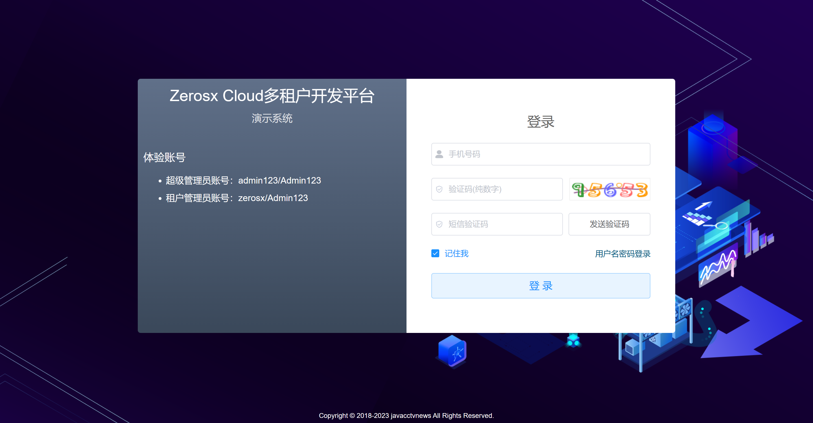

<h1 style="text-align:center">
    Zerosx-Cloud 多租户开发平台
</h1>


<div style="text-align: center">逝者如斯夫，不舍昼夜！</div>
<div style="text-align: center">
  
  
</div>
<div style="text-align: center">
  
  
  
  
  
  
</div>
<div style="text-align: center">
  
  
  
  
</div>
<h3 style="text-align:center;color:red;font-size:16px;">如果觉得对您有所帮助，请点右上角 "Star" 支持一下，谢谢啦</h3>

------


### 简介

此平台是由作者个人兴趣下搭建及开发，开源，免费，仅供学习参考。

* 基于JDK8、SpringBoot2.7.14、SpringCloud2021.0.5和SpringCloudAlibaba2021.0.5.0且采用前后端分离的微服务多租户体系架构；
* 采用自定义starter组件化的思想，结构解耦，易于扩展；
* 实现了SpringCloudGateway集成OAuth2统一认证授权及URL级功能权限校验（适用于网络隔离场景，即网关是统一入口），且可自定义扩展OAuth2授权模式；
* 集成Knife4j的OpenAPI3的接口文档，方便前后端对接，基础功能和文档注释完全由代码生成器一键生成（前后端代码）；
* 代码生成器一键生成基础CRUD功能，节约开发时间，更多注重业务开发；
* 提供一套基于Vue2.x的前端项目[zerosx-vue2]，此项目是参考【若依】前端开源改造，感谢若依，作者前端刚开始学习，勿喷。

### 软件架构图


> 备注：图中灰色虚线块组件作者并未搭建（服务器资源有限），只做一个选型参考。

### 项目结构简介

```shell
├─zerosx-cloud								#顶级工程目录
│ └─doc						              	#项目文档（组件、SQL、操作说明）
│ └─zerosx-api				              	#Feign对内api
│   └─zerosx-api-auth		              	#授权服务api
│   └─zerosx-api-examples	              	#示例工程api
│   └─zerosx-api-system		              	#系统服务api
│ └─zerosx-auth			                  	#授权认证服务
│ └─zerosx-commons		                  	#通用模块
│   └─zerosx-common-base					#公共POJO、工具类
│   └─zerosx-common-core					#公共核心模块
│   └─zerosx-common-db						#数据权限
│   └─zerosx-common-encrypt					#数据加解密
│   └─zerosx-common-loadbalancer			#loadbalancer和feign封装
│   └─zerosx-common-log						#日志记录
│   └─zerosx-common-oss						#OSS对象存储
│   └─zerosx-common-redis					#Redis封装
│   └─zerosx-common-seata					#分布式事务Seata
│   └─zerosx-common-security				#Spring Security封装
│   └─zerosx-common-sentinel				#Sentinel
│   └─zerosx-common-sms						#多家SMS短信集成
│   └─zerosx-common-xxljob					#分布式任务调度XXL-JOB
│ └─zerosx-examples		                  	#示例工程
│ └─zerosx-gateway		                  	#网关服务
│ └─zerosx-modules		                  	#业务模块
│   └─zerosx-system							#System服务
│ └─zerosx-tools			              	#工具工程
│   └─code-generator				      	#项目的代码生成器
│   └─zerosx-monitor						#SpringBootAdmin应用监控
│ └─zerosx-ui				              	#前端
│   └─zerosx-vue2			              	#前端-vue2版本
│   └─zerosx-vue3			              	#前端-vue3版本(计划)
│ └─pom.xml				                  	#公共依赖
│ └─README.md				              	#项目简介文档
```

### 本地开发说明

1. 组件安装教程及脚本请看【zerosx-cloud/doc/README.md】

2. 先启动zerosx-gateway、zerosx-auth、zerosx-system这三个项目；

3. 启动前端项目，如何启动请看文档【zerosx-cloud/zerosx-ui/zerosx-vue2/README.md】；

4. 浏览器访问前端地址，即可体验。

5. 调试接口文档：

   * 网关聚合入口：http://{gateway.host}:{gateway.port}/doc.html
   
   
      * 单体微服务入口：http://{app1.host}:{app1.port}/doc.html (推荐，无token校验)
   

### 内置功能简介

* 租户管理
    * 租户管理：接入系统的租户公司的管理
    * 套餐管理：租户套餐定价管理
* 权限管理
    * 用户管理：系统用户的配置，及管理租户的数据权限分配
    * 角色管理：角色菜单权限分配
    * 部门管理：配置租户的组织部门，也可用作用户组，简化新用户的权限分配
    * 岗位管理：岗位管理，用户所担任的职务
* 系统管理
    * 菜单管理：菜单、按钮、功能权限的管理，生成动态路由
    * 字典管理：数据字典的维护
    * 参数设置：系统动态参数的维护
    * 日志管理
        * 操作日志：操作记录日志
        * 登录日志：OAuth2授权登录日志
* 资源管理
    * 文件管理：OSS存储的文件管理，主要是维护所有文件上传到OSS服务器的记录
    * 行政区域：中华人民共和国行政区域的维护
    * 系统监控：SpringBootAdmin系统监控
    * 任务调度中心：XXL-JOB任务调度中心
    * 接口文档：OpenAPI3聚合接口文档
    * 短信配置：短信服务商及短信业务模板的相关配置

### 打包部署（示例）

1. 编译打包jar

```shell
mvn clean package -DskipTests -Pprod
```

2. 打包镜像

```shell 
# 网关服务
docker build -t zeros-cloud/zeros-gateway:v1.0.0 .
# 系统服务
docker build -t zeros-cloud/zerosx-modules/zerosx-system:v1.0.0 .
# 授权服务
docker build -t zeros-cloud/zeros-auth:v1.0.0 .
```

3. 推送远程仓库

   远程仓库使用的是阿里云的[容器镜像服务](https://cr.console.aliyun.com/cn-shenzhen/instances?spm=5176.8351553.0.0.4aec1991d9BtJE)（个人版），将第2步打包的镜像推送到远程仓库，在部署主机上拉取镜像进行部署，示例如下：

```shell
#推送远程仓库 示例
#登录
docker login --username=841****20@qq.com registry.cn-shenzhen.aliyuncs.com
#tag
docker tag [imageId] registry.cn-shenzhen.aliyuncs.com/zeros-cloud/zerosx-gateway:v1.1.0
#push
docker push registry.cn-shenzhen.aliyuncs.com/zeros-cloud/zeros-gateway:v1.1.0
```

* 部署说明（体验系统）

> 因服务器资源有限，组件均采用 **Docker** 单节点方式部署，使用 **Docker Compose** 进行编排，安装的组件及版本如下：<br>
> 
> 
> 
> <br>
> 部署应用如下：<br>
> 
> 
> 

### 在线体验

* 演示地址：<a href="http://120.79.152.222/index"> http://120.79.152.222/index </a>

> <span style="color:#666">目前版本只有基础功能，其他功能还在逐步完善中，敬请期待</span>

### 演示系统截图：

<table>
   <tr>
      <td></td>
      <td></td>
   </tr>
   <tr>
      <td></td>
      <td></td>
   </tr>
   <tr>
      <td></td>
      <td></td>
   </tr>
   <tr>
      <td></td>
      <td></td>
   </tr>
   <tr>
      <td></td>
      <td></td>
   </tr>
   <tr>
      <td></td>
      <td></td>
   </tr>
   <tr>
      <td></td>
      <td></td>
   </tr>
   <tr>
      <td></td>
      <td></td>
   </tr>
   <tr>
      <td></td>
      <td></td>
   </tr>
   <tr>
      <td></td>
      <td></td>
   </tr>
</table>

