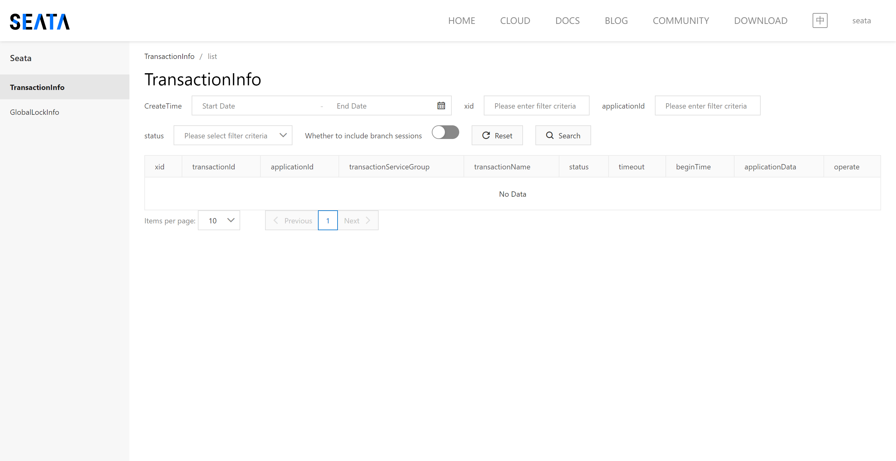

# 系统部署说明

> <a href="https://docs.docker.com/compose/install/">Docker Desktop安装可参考官网：https://docs.docker.com/compose/install </a>

## 组件部署

> 建议：初学者按文档介绍的组件顺序执行脚本进行安装，比较不容易出错，即Redis、MySql、Nacos、Seata的顺序

> 如果完全按照文档安装，只需要改IP（192.168.3.6）即可

### 1. Redis

1. 版本：6.2.13，配置文件中的密码：zerosx@123456，端口：6479（可自行修改）

2. 执行安装：
    ```shell
    # 进入目录(可用拷贝到指定目录)
    cd zerosx-cloud/doc/redis
    # 安装(指定文件)
    docker-compose -f docker-compose.yaml up -d
    ```

3. 推荐一款Redis可视化管理工具

    > [QuickRedis](https://sourceforge.net/projects/quickredis/files/)

### 2. MySql8
1. 版本：8.0.34，端口：13306，密码：zerosx@123456

2. 执行安装：
   ```shell
   # 进入目录
   cd zerosx-cloud/doc/mysql8
   # 安装(指定文件)
   docker-compose -f docker-compose.yaml up -d
   ```
### 3. Nacos
1. 版本：2.2.0 ，端口：8848

2. 执行nacos数据库脚本：
   ```shell
   执行SQL脚本，文件所在目录：zerosx-cloud/doc/nacos/mysql-schema.sql
   ```
   
3. 修改文件：zerosx-cloud/doc/nacos/docker-compose-nacos2.2.0.yaml，修改项如下：
   ```shell
   #把ip修改成安装主机的IP
   - MYSQL_SERVICE_HOST=192.168.3.6
   ```
   
4. 执行安装
   ```shell
   # 进入目录
   cd zerosx-cloud/doc/nacos
   # 安装(指定文件)
   docker-compose -f docker-compose-nacos2.2.0.yaml up -d
   ```
   
5. 登录Nacos控制台：http://127.0.0.1:8848/nacos 用户名：nacos 密码：nacos
   * 新建命名空间，表单内容填写如下：
     
     > 命名空间ID: 32c6d87e-c726-44c5-a87b-a89b0f91c63d
     >
     > 命名空间名: local
     >
     > 描述: 本地开发使用
     >
     > 
     
   * 导入微服务配置
     
     * 方式1：按【zerosx-cloud/doc/zerosx/nacos-config】下文件名逐个新建配置，分组Group名：local
     
       ```shell
       # common-local.yaml  		#所有服务共享的配置
       # seataServer.properties	#seata组件的配置
       
       # zerosx-gateway-local.yaml	#zerosx-gateway网关配置
       # zerosx-auth-local.yaml	#zerosx-auth服务配置
       # zerosx-system-local.yaml	#zerosx-system服务配置
       
       ```
     
     * 方式2：导入方式，压缩文件【zerosx-cloud/doc/zerosx/nacos-config/nacos_config_export_20230905.zip】
     
   * 
### 4. Seata

1. 版本：1.6.1

2. 创建Seata数据库表

   ```shell
   执行SQL脚本，文件所在目录：zerosx-cloud/doc/seata/mysql-schema.sql
   ```

3. 修改【zerosx-cloud/doc/seata/docker-compose-seata1.6.1.yaml】，修改内容：

   ```shell
   # seata安装主机的IP
   - SEATA_IP=192.168.3.6
   ```

   

4. 修改【zerosx-cloud/doc/seata/seata-server】下的文件

   * 文件是从官方镜像【seataio/seata-server:1.6.1】中拷贝出来的文件（官方安装文档中有此说明）

   * 修改【zerosx-cloud/doc/seata/seata-server/resources/application.yml】 ，修改内容如下：

     ```shell
     # 注册中心和配置中心（按需修改）
     # 修改成nacos的ip端口（2处）
     server-addr: 192.168.3.6:8848
     # namespace
     namespace: 32c6d87e-c726-44c5-a87b-a89b0f91c63d
     ```
     
     

5. 新增Nacos配置【seataServer.properties】，并修改如下内容：

   ```shell
   # Seata数据库
   store.db.url=jdbc:mysql://192.168.3.6:13306/seata_v161?useUnicode=true&rewriteBatchedStatements=true&allowPublicKeyRetrieval=true
   # 用户名
   store.db.user=root
   # 密码
   store.db.password=zerosx@123456
   ```

6. 执行安装

   ```shell
   # 进入目录
   cd zerosx-cloud/doc/seata
   # 安装(指定文件)
   docker-compose -f docker-compose-seata1.6.1.yaml up -d
   ```

   > [Seata官网安装教程地址](https://seata.io/zh-cn/docs/v1.6/ops/deploy-by-docker-compose)

7. Seata控制台

   > 访问地址：http://192.168.3.6:7091/#/login  
   >
   > 用户名：seata  密码：seata，在文件【zerosx-cloud/doc/seata/seata-server/resources/application.yml】中配置
   
   

### 5. 服务库表SQL

​	初始脚本，包括库表创建及初始数据，文件【zerosx-cloud/doc/zerosx/zerosx-sql】

```shell
执行SQL脚本，文件所在目录：zerosx-cloud/doc/zerosx/zerosx-sql
# zerosx_auth.sql 			#auth服务数据库
# zerosx_system.sql			#system服务数据库、菜单目录、初始登录用户
# zerosx_resource.sql		#resource服务数据库、菜单目录、初始登录用户
# t_area_city_source.sql	#行政区域初始数据
```

## 微服务部署(示例)

> * 采用的是阿里云服务器部署作为案例，配置是：2vCPU/4GiB-高效云盘/60GiB
>
> * Docker仓库采用阿里云的[容器镜像服务（个人版）](https://cr.console.aliyun.com/cn-shenzhen/instances)

### 1. 编译打包

```shell
# 进入项目根目录
cd zerosx-cloud
# 编译打包所有jar
mvn clean package -DskipTests -Pprod
```

### 2. 打包docker镜像

```shell 
### 这里以 zerosx-gateway 作为示例，cd命令是在项目根路径下

# 1. 网关服务(zerosx-gateway)
cd zerosx-gateway
docker build -t zerosx-cloud/zerosx-gateway:0.0.1 .
# 推送容器仓库
# 登录 替换[username] 按enter输入密码
docker login --username=[username] registry.cn-shenzhen.aliyuncs.com
# tag 替换[imageId]即可。备注：zerosx-cloud是命名空间（需要在阿里云自行创建）
docker tag [imageId] registry.cn-shenzhen.aliyuncs.com/zerosx-cloud/zerosx-gateway:0.0.1
# push
docker push registry.cn-shenzhen.aliyuncs.com/zerosx-cloud/zerosx-gateway:0.0.1


# 2. zerosx-auth
cd zerosx-auth
docker build -t zerosx-cloud/zerosx-auth:0.0.1 .
# 推送容器仓库
# 登录 替换[username] 按enter输入密码
docker login --username=[username] registry.cn-shenzhen.aliyuncs.com
# tag 替换[imageId]即可。备注：zerosx-cloud是命名空间（需要在阿里云自行创建）
docker tag [imageId] registry.cn-shenzhen.aliyuncs.com/zerosx-cloud/zerosx-auth:0.0.1
# push
docker push registry.cn-shenzhen.aliyuncs.com/zerosx-cloud/zerosx-auth:0.0.1

# 3.zerosx-system（zersox-resource同理）
cd zerosx-modules/zerosx-system
docker build -t zerosx-cloud/zerosx-system:0.0.1 .

# 推送容器仓库
# 登录 替换[username] 按enter输入密码
docker login --username=[username] registry.cn-shenzhen.aliyuncs.com
# tag 替换[imageId]即可。备注：zerosx-cloud是命名空间（需要在阿里云自行创建）
docker tag [imageId] registry.cn-shenzhen.aliyuncs.com/zerosx-cloud/zerosx-system:0.0.1
# push
docker push registry.cn-shenzhen.aliyuncs.com/zerosx-cloud/zerosx-system:0.0.1

# 4.前端vue项目部署
cd zerosx-ui/zerosx-vue2
# 构建生产环境
npm run build:prod
# 打包镜像
cd zerosx-ui/zerosx-vue2/docker
docker build -t zerosx-cloud/zerosx-vue2:0.0.1 .

# 推送容器仓库
# 登录 替换[username] 按enter输入密码
docker login --username=[username] registry.cn-shenzhen.aliyuncs.com
# tag 替换[imageId]即可。备注：zerosx-cloud是命名空间（需要在阿里云自行创建）
docker tag [imageId] registry.cn-shenzhen.aliyuncs.com/zerosx-cloud/zerosx-vue2:0.0.1
# push
docker push registry.cn-shenzhen.aliyuncs.com/zerosx-cloud/zerosx-vue2:0.0.1

```

### 拉取镜像并部署

> 采用docker-compose方式进行编排部署，文件：doc/zerosx/docker-compose-service.yaml

```shell
# 进入文件夹
cd doc/zerosx
# 执行部署
docker-compose -f docker-compose-service.yaml up -d
```
